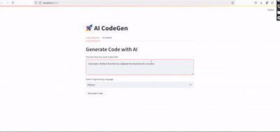

# Multi-Agent Dev Assistant

The Multi-Agent AI-Powerd dev Assistant is a cutting-edge, AI-powered platform designed to revolutionize the way developers work. It seamlessly generates code across multiple programming languages, offers real-time code explanations, provides advanced debugging support, and features an interactive chat assistant for enhanced collaboration. Additionally, this all-in-one tool boasts the unique ability to convert images into code, empowering developers to translate visual concepts into functional code with ease. By streamlining the development process, this intelligent assistant aims to make coding faster, more efficient, and error-free, while supporting a wide range of programming environments.

## Features

- **Code Generation**: Generate code snippets based on user prompts in various programming languages.
- **Code Explanation**: Get explanations for the generated code to enhance understanding.
- **AI Chatbot**: Ask coding questions and receive instant responses from the AI chatbot.
- **Multi-language Support**: Support for various programming languages, allowing flexibility in code generation.
- **Code Dubbeger**: Debugging and error detection capabilities to ensure code quality.
- **Image to Code**: Convert images into code, facilitating the translation of visual concepts into functional code.

## Installation

To run the AI Code Assistant, follow these steps:

1. **Clone the Repository**:
   ```bash
   git clone https://github.com/Getachew0557/AI-agent.git
   cd AI-agent/ai_code_agent
Set Up Virtual Environment (optional but recommended):

```bash
python3 -m venv venv
source venv/bin/activate  # On Windows use `venv\Scripts\activate`
```
Install Required Dependencies:

```bash
pip install -r requirements.txt
```
## Configure API Key:

- Create a config.py file in the root directory and add your Gemini API key:

```python
GEMINI_API_KEY = 'your_api_key_here'
```
## Usage
- Run the Streamlit Web Application
- To start the web application, run the following - command:

```bash
streamlit run frontend/streamlit_app.py
```
- Open your browser and navigate to http://localhost:8501 to access the application.

- Command Line Interface (CLI)
You can also use the CLI to generate code directly:

```bash
python backend/main.py
```

## Demo

Here’s a quick demonstration of the AI Code Assistant in action:



## Folder Structure
```graphql
ai_code_agent/
│── models/
│   ├── gemini.py          # Handles Gemini API integration
│── chat/
│   ├── chatbot.py         # AI Chatbot for code queries
│── utils/
│   ├── language_support.py # Handles multiple programming languages
│   ├── code_explainer.py   # Explains generated code
│── frontend/
│   ├── streamlit_app.py   # Streamlit web UI for interaction
│── backend/
│   ├── main.py            # CLI-based code generator
│── config.py              # API configuration file
│── requirements.txt       # Required dependencies
│── README.md              # Documentation
```
## Contributing
Contributions are welcome! If you'd like to contribute to this project, please follow these steps:

Fork the repository.
Create a new branch for your feature or bug fix:
bash
Copy
Edit
git checkout -b feature/YourFeatureName
Make your changes and commit them:
```bash
git commit -m "Add Your Feature"
Push to the branch:
```
```bash
git push origin feature/YourFeatureName
```
- Create a pull request.

## License
This project is licensed under the MIT License - see the LICENSE file for details.

## Acknowledgements
Gemini API for providing the AI capabilities.

### Customization

Feel free to customize the `README.md` file according to your project's specific details, such as the Gemini API documen